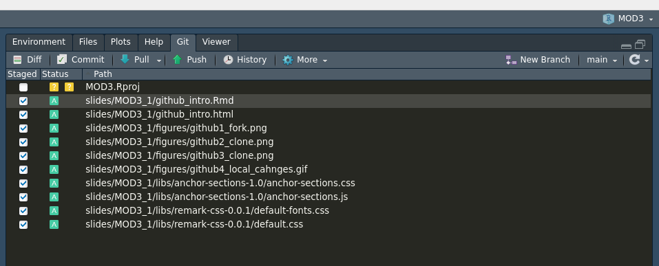
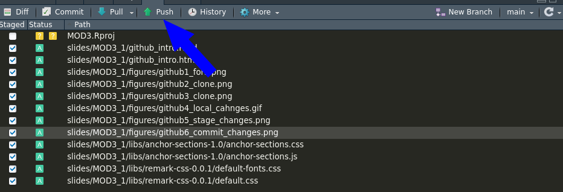
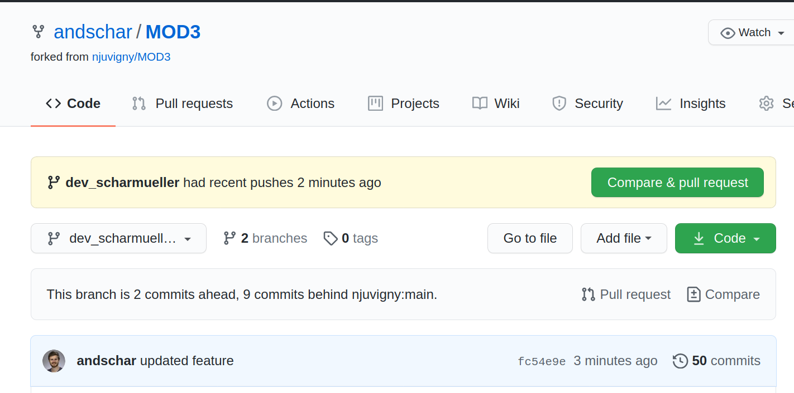
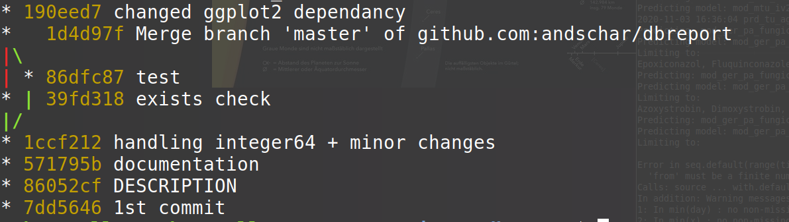

```{r setup, include=FALSE}
options(htmltools.dir.version = FALSE)
```

## Why Git?

.pull-left[

- Modern software development
  - most R-packages
- Version control
- Git is the __software__
- GitHub is the __platform__
]

.pull-right[


]

#### Other Plattforms
- GitLab: <https://about.gitlab.com>
- BitBucket: <https://bitbucket.org>

---
## Create a GitHub account


---
## Create (initialize) repository

#### Locally

```sh
git init
```

#### Remote


---
## Fork a repository

- Fork someone's repo to your GitHub account


---
## Clone a repository

- Clone __your__ fork (i.e. version) to your local machine


---
## Clone a repository

```sh
cd Projects
git clone git@github.com:njuvigny/MOD3.git
git clone https://github.com/njuvigny/MOD3.git
```


---
## Local changes

- Make changes to the `.txt`, `.R`, `.python` or to whatever file


---
## Stage your changes

```sh
git add file.txt
git add *.txt
git add -A
```

---
## Commit changes

```sh
git commit -m 'test'
```


---
## Push to your repo (origin)

```sh
git push origin master
git push origin main
```


---
## Pull Request

#### From your main branch to the remote main branch


---
class: center, inverse, middle
# Branches


---
## Branch

#### Create/Switch Branch

```sh
git checkout -b dev_scharmueller
git checkout main
git status
git branch
```


---
## Branch

#### Merge Branch

```sh
git checkout master
git merge dev_scharmueller
```

---
## Pull Request

#### From your dev_XXX branch to a new remote dev_XXX branch


---
## Branch

First 8 commits of my R-package repo <andschar/dbreport>

```sh
git log --all --decorate --oneline --graph
```



---
class: center, inverse, middle


---
## Task

- Fork Noel's repo: <https://github.com/njuvigny/MOD3>
- Clone it to local machine
- Create a new branch named dev_YOURSURNAME
- Change the file __git_intro/task.Rmd__ according to the steps described in said file
- Create a .html out of the .Rmd file
- Add & Commit both files in the new branch
- Push local changes to your repo
- Create a Pull Request against Noel's repo

---
## Material

- OpenOlat
- StackOverflow
- YouTube
- <https://guides.github.com/activities/hello-world>
- <https://support.rstudio.com/hc/en-us/articles/200532077-Version-Control-with-Git-and-SVN>

### Made with
- <https://github.com/rstudio/rmarkdown>
- <https://github.com/yihui/knitr>
- <https://github.com/yihui/xaringan>

---
## Other things

- <https://github.com/rstudio/blogdown>
- <https://github.com/r-lib/pkgdown>

---
class: center, middle, inverse

# Thank you for your attention!
