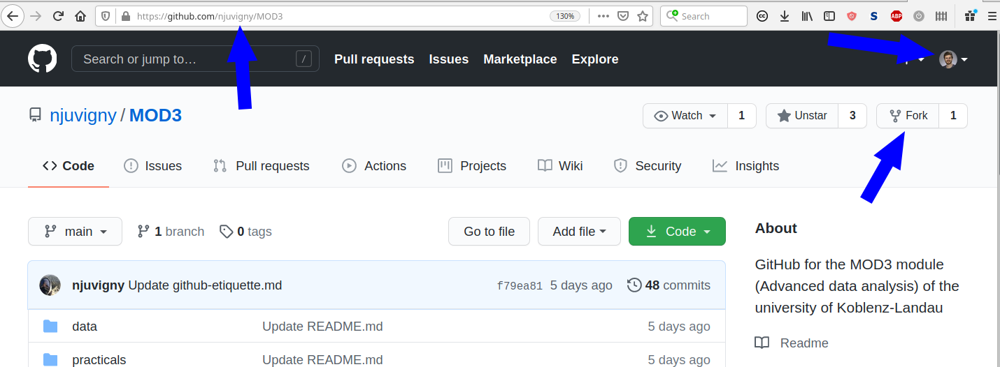
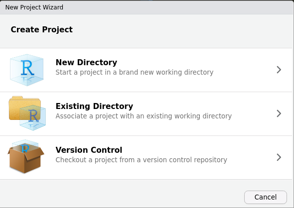
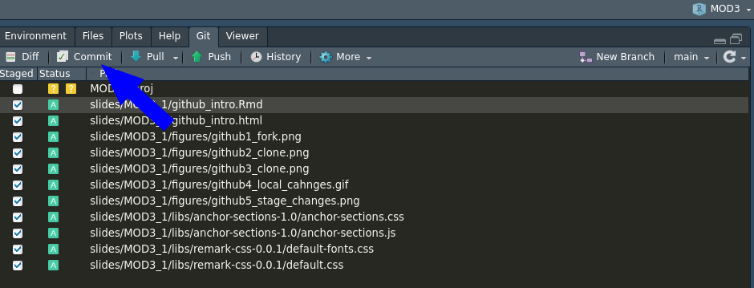
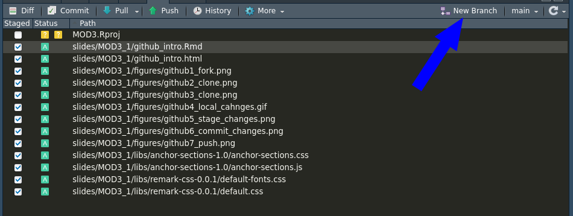
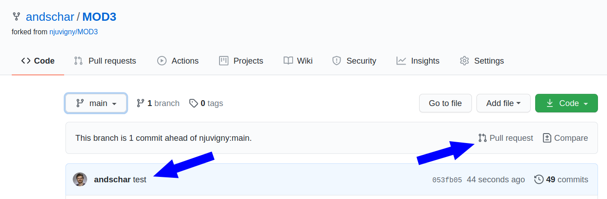

## Create a GitHub account

- modern software development
- Git is software
- GitHub is platform

#### Other Plattforms
- GitLab
- BitBucket

---
## Fork a repository

- Fork from someone to your GtiHub account

---
## Clone a repository

- Clone __your__ fork (i.e. version) to your local machine

---
## Clone a repository

`cd Projects`

`git clone git@github.com:njuvigny/MOD3.git`

---
## Local changes

- Make changes to the `.txt`, `.R`, `.python` or to whatever file

{#id .class height=3px}
---
## Stage your changes

`git add file.txt`

`git add -A`

---
## Commit changes

`git commit -m 'message here'`

---
## Push to your repo (origin)

`git push origin master`

`git push origin main`

---
## Switch branch

`git checkout -b dev_scharmueller`

`git chekcout main`

---
## Pull-Request to original repo (remote)

---
## Task

- Fork Noel's repo
- Clone it to local machine
- Create a new branch named dev_YOURSURNAME
- Change the file XXX
- Commit the change (+ commit message) (in the new branch!)
- Push local changes to your repo
- Create a Pull Request against Noel's repo

